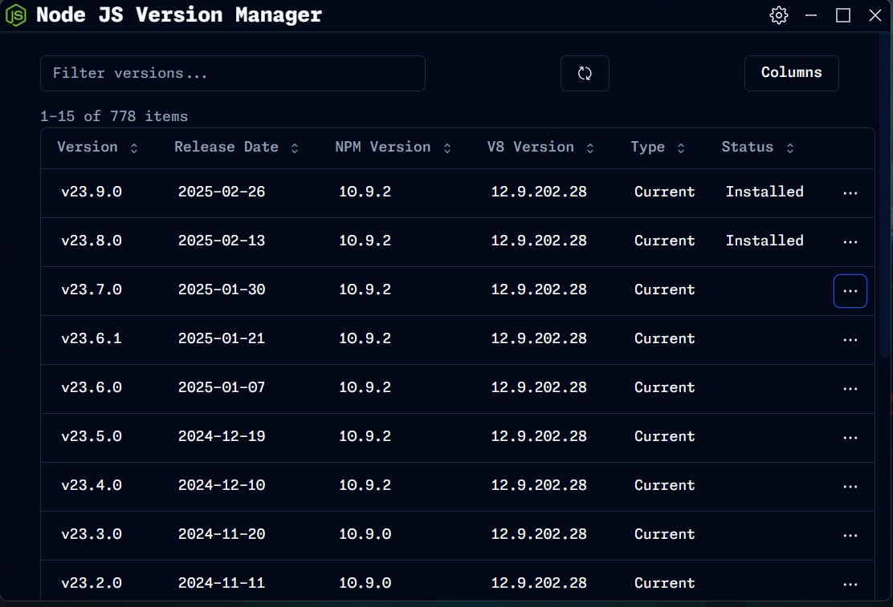

<div  align="center">
    
    <h1>Version Manager</h1>
    <h3>A Node JS Version Manager GUI tool made using Tauri.</h3>
</div>

> [!NOTE]
>
> ### [Download For Windows From Here](https://github.com/Ulrich-Tonmoy/vm/releases)

<div  align="center">
    
</div>

### Features

- [x] Show LTS, Current, Stable and Unstable old available Node Version.
- [x] Download/install Multiple Node versions.
- [x] Change Node version from the installed/downloaded version.

### Technologies

- [x] Tauri
- [x] React
- [x] TypeScript
- [x] Tailwind CSS
- [x] Jotai
- [x] Shadcn

## How to run locally (Windows)

> [!TIP]
> Recommended IDE Setup
>
> - [VS Code](https://code.visualstudio.com/) + [Tauri](https://marketplace.visualstudio.com/items?itemName=tauri-apps.tauri-vscode) + [rust-analyzer](https://marketplace.visualstudio.com/items?itemName=rust-lang.rust-analyzer)

> [!IMPORTANT]  
> Tools Needed
>
> - [Node.js](https://nodejs.org/en/download/) + [Rust](https://www.rust-lang.org/tools/install) + [Visual Studio C++ toolchain](https://visualstudio.microsoft.com/vs/features/cplusplus/)

> [!NOTE]  
> Commands
>
> - Open the folder in `vs code` or `terminal`.
> - Run the `npm i` to install the packages.
> - Then run the `npm run tauri dev` to run the project.

```
<!-- Folder Structure store data -->
AppData/Roaming/Version Manager/
├── v20.15.1
├── ... all downloaded versions
├── version-list.json
└── config.json
```

<!-- https://github.com/1111mp/nvm-desktop -->
